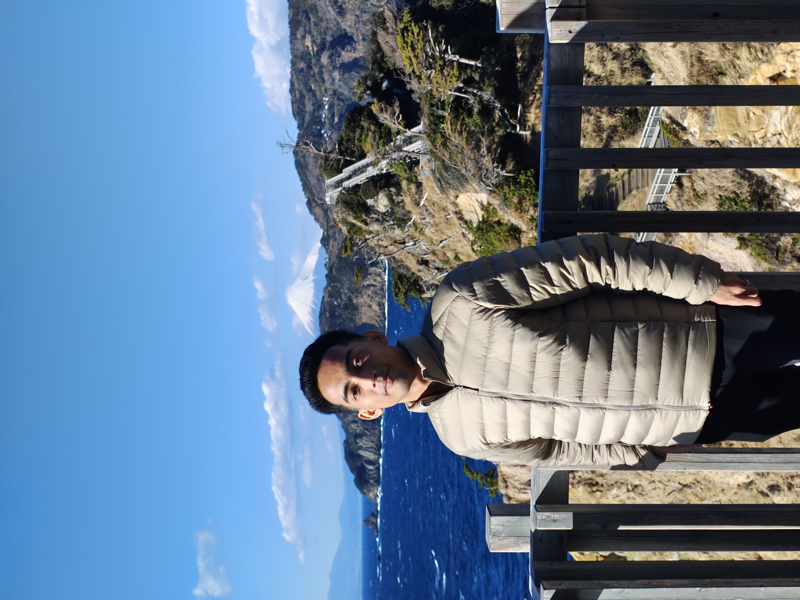

# Risky-portofolio
<!DOCTYPE html>
<html lang="en">
<head>
  <meta charset="UTF-8" />
  <meta name="viewport" content="width=device-width, initial-scale=1.0" />
  <title>Hey,Im Risky Nur Rahman | Web Design Freelancer</title>
  
  <link href="https://fonts.googleapis.com/css2?family=Inter:wght@400;600;800&display=swap" rel="stylesheet">
  
</head>
<body class="bg-gray-50 text-gray-800">
  <header class="bg-gray-900 text-white py-12 text-center">
    <h1 class="text-5xl font-extrabold">Risky Nur Rahman</h1>
    
Freelance Web Designer | UI/UX Specialist | Frontend Developer

  </header>

  <main class="max-w-6xl mx-auto px-6 py-12">
    <section class="mb-16">
      <section class="mb-16">
  
  
  

      <h2 class="text-4xl font-semibold mb-6 border-b pb-2">About Me</h2>
      

        Hello! I'm Risky, a professional freelance web designer based in Indonesia. With over 2 years of experience, I design and build visually stunning, user-friendly, and high-performing websites that help brands grow and connect with their audiences. My approach combines clean aesthetics, strategic UX, and mobile-first development to deliver sites that don’t just look great — they work.
      

    </section>

    <section class="mb-16">
      <h2 class="text-4xl font-semibold mb-6 border-b pb-2">Services</h2>
      

        

          <h3 class="text-xl font-semibold mb-2">Responsive Web Design</h3>
          
Fully optimized websites that work perfectly on all devices.

        

        

          <h3 class="text-xl font-semibold mb-2">UI/UX Design</h3>
          
Modern, user-focused interfaces that keep visitors engaged and converting.

        

        

          <h3 class="text-xl font-semibold mb-2">WordPress & CMS</h3>
          
Custom themes and content management systems tailored to your brand.

        

        

          <h3 class="text-xl font-semibold mb-2">eCommerce Development</h3>
          
Shopify and WooCommerce storefronts optimized for sales and speed.

        

      

    </section>

    <section class="mb-16">
      <h2 class="text-4xl font-semibold mb-6 border-b pb-2">Portfolio</h2>
      

        

          <h3 class="text-xl font-semibold">Clothing Store – Shopify</h3>
          
Redesigned and developed a fashion brand’s online store, improving user retention by 40% and mobile performance score by 85%.

        

        

          <h3 class="text-xl font-semibold">Travel Blog – WordPress</h3>
          
Built a fully custom WordPress theme with SEO-first architecture, increasing organic traffic by 300% in 60 days.

        

        

          <h3 class="text-xl font-semibold">Startup Landing Page</h3>
          
Designed a high-converting landing page that increased newsletter signups by 65% and reduced bounce rate.

        

      

    </section>

    <section class="mb-16">
      <h2 class="text-4xl font-semibold mb-6 border-b pb-2">Tech Stack</h2>
      
Figma, Adobe XD, Photoshop, HTML5, CSS3, JavaScript, TailwindCSS, Bootstrap, WordPress, Shopify, Webflow, Git, VS Code

    </section>

    <section class="mb-16">
      <h2 class="text-4xl font-semibold mb-6 border-b pb-2">Workflow</h2>
      <ol class="list-decimal list-inside space-y-3 text-lg">
        <li>Initial consultation and understanding client needs</li>
        <li>Wireframing and visual prototyping in Figma</li>
        <li>Client feedback, revisions, and approval</li>
        <li>Frontend development and CMS integration</li>
        <li>Testing, optimization, and final delivery</li>
      </ol>
    </section>

    <section class="mb-16">
      <h2 class="text-4xl font-semibold mb-6 border-b pb-2">Client Testimonials</h2>
      <blockquote class="italic border-l-4 border-blue-500 pl-4 mb-4 text-lg">
        “Risky delivered exactly what we needed. The design is stunning, the user flow is intuitive, and he was communicative throughout the project.” — Jonas., Entrepreneur
      </blockquote>
      <blockquote class="italic border-l-4 border-blue-500 pl-4 text-lg">
        “We saw measurable improvements in site engagement and conversions after Risky redesigned our homepage. Highly recommended!” — Jeremy lancing Hayes., Digital Strategist
      </blockquote>
    </section>

    <section class="mb-16">
      <h2 class="text-4xl font-semibold mb-6 border-b pb-2">Contact Me</h2>
      
Interested in working together? Let's talk!

      <ul class="space-y-2 text-lg">
        <li>Email: <a href="mailto:riskyaja930@gmail.com" class="text-blue-600 hover:underline">riskyaja930@gmail.com</a></li>
        <li>WhatsApp: <a href="https://wa.me/6287818630770" class="text-blue-600 hover:underline">6287818630770</a></li>
        <li>Instagram: <a href="https://instagram.com/Albert_toft001" class="text-blue-600 hover:underline">@Albert_toft001</a></li>
      </ul>
    </section>
  </main>

  <footer class="bg-gray-900 text-white text-center py-6">
    
&copy; 2025 Risky Nur Rahman. Designed and developed with precision and passion.

  </footer>
</body>
</html>
